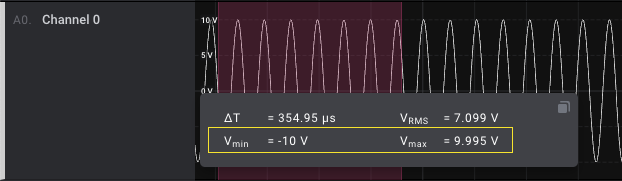

# Voltage Min/Max

An extension that adds Voltage Min/Max metrics to analog measurements.

## Instructions
1. Install this extension by clicking "Install"
2. Add a measurement by clicking on the "Annotations panel" on the right, then the Measurements "+" icon.

3. Drag the measurement selection window over your digital data.
